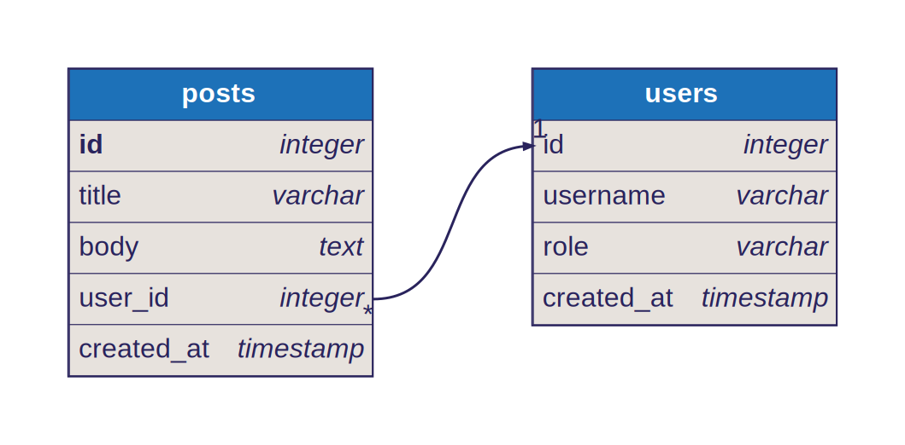

[](https://www.npmjs.com/package/@softwaretechnik/dbml-renderer) [](https://github.com/softwaretechnik-berlin/dbml-renderer/actions/workflows/build.yml)

`dbml-renderer` renders [DBML](https://www.dbml.org/home/) files to SVG images.
It provides a command line interface, so that you can easily use it in your
documentation toolchain.

## Command Line Usage

```bash
npm install -g @softwaretechnik/dbml-renderer
```

It can then be used to render DBML files like so:

```bash
dbml-renderer -i example.dbml -o output.svg
```

For instance, the following input will produce the image below:

```dbml
Table users {
    id integer
    username varchar
    role varchar
    created_at timestamp
}

Table posts {
    id integer [primary key]
    title varchar
    body text [note: 'Content of the post']
    user_id integer
    created_at timestamp
}

Ref: posts.user_id > users.id
```



The [examples directory](examples/) contains other input and output examples.

## Testing

The tests can be run with `npm test`. They use the examples available in the
`examples` directory. Each `.dbml` file is used as input to render each of the
available output formats.

The output of a test run is placed in `.test-output`. In case the renderer has
been modified, the test output can be visually inspected and, confirmed the
output is good, the expectations can be updated by copying them with the
following command:

```bash
cp .test-output/* examples/
```

To aid the visual inspection, you can open `.compare-test-output.html` to
compare side-by-side each generated SVG.
